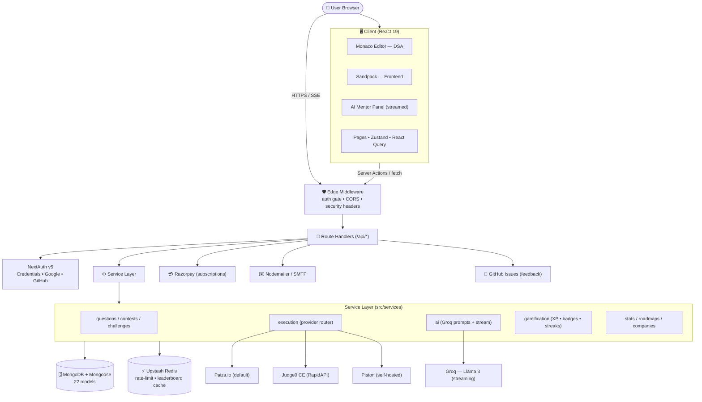
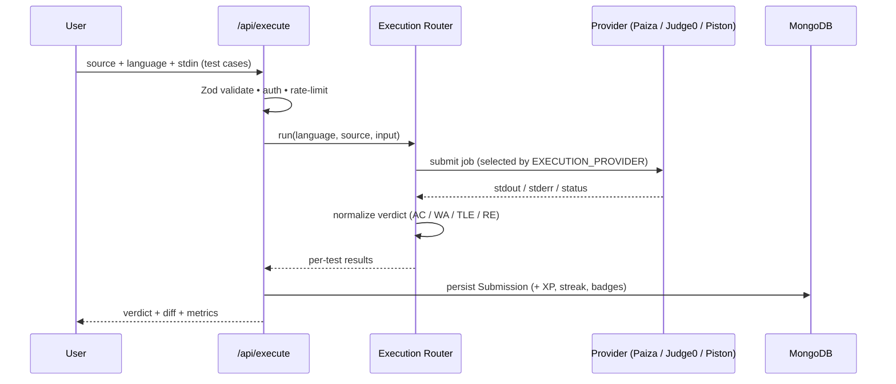

<div align="center">


# CodeForge AI

### Your AI-powered coding interview prep workspace

LeetCode-style DSA problems · Frontend sandbox challenges · Live contests · Personalized roadmaps · Spaced-repetition revision · A community forum · Local mock interviews · A real-time streaming **AI Mentor** — all in one cohesive developer workspace.

<br/>

[](https://nextjs.org/)
[](https://react.dev/)
[](https://www.typescriptlang.org/)
[](https://tailwindcss.com/)
[](https://www.mongodb.com/)
[](https://upstash.com/)
[](https://groq.com/)
[](https://opensource.org/licenses/MIT)

<a href="#-getting-started"><b>Getting Started</b></a> ·
<a href="#-core-features"><b>Features</b></a> ·
<a href="#-tech-stack"><b>Tech Stack</b></a> ·
<a href="#-changelog"><b>Changelog</b></a> ·
<a href="#-deployment"><b>Deployment</b></a>

</div>

---

## 🏗 System Architecture

CodeForge AI is a **single Next.js 15 (App Router) application** that serves the UI, the API, and background work from one codebase. It follows a layered design — **route handlers → service layer → data/integration layer** — so that providers (code runners, AI, payments) are swappable behind interfaces and the app degrades gracefully when any optional integration is absent.

### High-Level Topology



### Request Lifecycle

1. **Edge middleware** ([src/middleware.ts](src/middleware.ts)) runs first on every request. It checks the NextAuth session against a public-route allowlist, enforces same-origin/CORS on mutating requests, and attaches security headers (CSP, HSTS, `X-Frame-Options: DENY`).
2. **Route handlers** under `src/app/api/*` validate input with **Zod**, resolve the session, and apply **rate limiting** (Upstash sliding window, with an in-memory fallback) before doing work.
3. **Service layer** (`src/services/*`) holds the business logic — question/contest queries, the execution-provider router, AI prompt orchestration, gamification, and stats — keeping handlers thin.
4. **Data & integrations** — Mongoose models persist state; Redis caches hot reads (leaderboards) and rate-limit counters; external providers (Groq, Razorpay, SMTP, GitHub, code runners) are called through small adapter modules in `src/lib` and `src/services`.

### Layer Responsibilities

| Layer | Location | Responsibility |
| :--- | :--- | :--- |
| **Client** | `src/app/(platform)`, `src/features`, `src/components` | React 19 UI, Monaco/Sandpack workspaces, Zustand workspace store, React Query server-state cache |
| **Edge** | `src/middleware.ts`, `src/lib/auth.config.ts` | Auth gating, CORS/origin guard, security headers, cookie policy |
| **API** | `src/app/api/*` | Route handlers: validation (Zod), authz (`lib/api-auth`), rate-limit, response shaping |
| **Services** | `src/services/*` | Domain logic: questions, contests, execution, AI, gamification, stats, roadmaps |
| **Integrations** | `src/lib/*` | `mongodb`, `redis`, `mailer`, `github`, `site-config`, `rate-limit`, `sanitize`, `openapi` |
| **Data** | `src/models/*` (22 Mongoose models) | Users, Questions, Submissions, Contests, Discussions, Subscriptions, SpacedRepetition, Badges, etc. |

### Code Execution Pipeline



The provider is chosen at runtime by `EXECUTION_PROVIDER`; all providers conform to one interface in `src/services/execution`, and outputs pass through a `normalize` step so verdicts are consistent regardless of backend.

### AI Mentor Pipeline

The AI panels post the **problem, code buffer, and runtime output** to streaming routes under `/api/ai/*`. The `ai` service composes a system prompt (progressive-hint policy) and forwards to **Groq (Llama 3)**, relaying tokens to the client over **Server-Sent Events** for real-time rendering. If `GROQ_API_KEY` is absent, the routes short-circuit and the UI shows inline setup guidance instead of failing.

### Resilience by Design

Every external dependency is optional and isolated, so a missing key degrades one feature rather than breaking the app: **no Redis** → in-memory rate-limit + on-demand leaderboard from Mongo; **no Groq** → AI panels show setup help; **no Razorpay** → billing hidden; **no SMTP/GitHub** → feedback and emails fall back or no-op; **DB unreachable at build** → `robots.txt`/`sitemap.xml` render dynamically rather than crashing the build.

---

## ✨ Core Features

<table>
<tr>
<td width="50%" valign="top">

### 🧑‍💻 Hybrid Coding Workspaces
- **DSA Workspace** — Monaco editor with themes, font controls, **Vim** keybindings, Emmet, fullscreen, split-pane output, and auto-save (local + MongoDB).
- **Frontend Sandbox** — In-browser Sandpack for HTML/CSS, Vanilla JS, React & Tailwind with live hot-reload and a console emulator.
- **12 Languages** — JS, TS, Python, Java, C, C++, C#, Go, PHP, Rust, Kotlin, Swift.
- **Pluggable Engines** — Paiza, Judge0, or self-hosted Piston.

</td>
<td width="50%" valign="top">

### 🤖 Live AI Mentor (Groq)
- **Context-Aware** — Understands the problem, your code buffer, and runtime output.
- **Progressive Hints** — Concept → algorithm → edge cases → optimization, never spoiling the answer.
- **Explain & Visualize** — "Why is this failing?" and time/space complexity, all streamed in real time.

</td>
</tr>
<tr>
<td width="50%" valign="top">

### 🛠 AI Tools Suite (`/ai-tools`)
- **Learning Coach** — guidance tuned to your weak areas
- **Pair Programmer** — conversational coding help
- **Study Planner** — structured plans toward a date
- **Complexity Analyzer** — Big-O breakdowns
- **Code Review** — correctness, style & edge cases
- **Roadmap / Contest / Resume** generators
- **Project Review** — AI review of sandbox projects

</td>
<td width="50%" valign="top">

### 📚 Problems, Tracks & Roadmaps
- **Problem Bank** — filter by difficulty, tag & company.
- **Tracks & Roadmaps** — ordered, guided learning paths.
- **Company Prep** — Google, Meta, Amazon, Microsoft, Netflix, Uber & more.
- **Daily Plan** — a personalized daily study queue.

</td>
</tr>
<tr>
<td width="50%" valign="top">

### 🔁 Revision & Memory
- **Spaced Repetition (SM-2)** — concepts resurface on an optimal schedule.
- **Revision Queue** — review due items in one flow.
- **Notes & Bookmarks** — per-problem notes and saved questions.

</td>
<td width="50%" valign="top">

### 📈 Analytics & Weakness Detection
- **Weakness Detection** — surfaces topics you struggle with most.
- **Personal Analytics** — progress charts, submission trends & accuracy (Recharts).

</td>
</tr>
<tr>
<td width="50%" valign="top">

### 🔥 Gamification & Streaks
- **GitHub-style Heatmap** of daily activity.
- **XP & Levels** for correct, fast submissions.
- **Unlockable Badges** by category, streak & placement.

</td>
<td width="50%" valign="top">

### 🏆 Contests & Leaderboards
- **Time-Penalty Scoring** on completion time & wrong attempts.
- **Real-time Standings** via MongoDB aggregation, cached in Redis.
- **Daily Challenge** with double-XP rewards.

</td>
</tr>
<tr>
<td width="50%" valign="top">

### 🎤 Mock Interviews
- **Simulated Sessions** with custom queues and strict timers.
- **Local Recording** of voice, video & workspace in-browser.
- **AI Feedback Report** on code cleanliness, debugging speed & approach.

</td>
<td width="50%" valign="top">

### 💬 Community & Social
- **Discussion Forum** (`/discuss`) — threaded solutions & doubts.
- **Follow System** & **Public Profiles** with badges, stats & heatmaps.
- **Feedback Channel** routed to admins.

</td>
</tr>
<tr>
<td width="50%" valign="top">

### 💳 Subscriptions & Billing
- **Razorpay** — order creation, verification & cancellation.
- **Free Trials** — Go Plan free for 30 days, no card.
- **Beta Program** — `/beta/join`, first **50** users get the Go Plan free.

</td>
<td width="50%" valign="top">

### 🛡 Admin Dashboard (`/admin`)
- **Questions** — AI-generate, upload JSON, edit & publish.
- **Users** — inspect, manage subscriptions, promote admins.
- **Contests, Challenges, Prompt Templates & Site Settings.**
- **Analytics & Submissions** insights.

</td>
</tr>
</table>

> **Onboarding & Accounts** — Guided onboarding flow, **NextAuth.js v5** with email/password plus optional Google & GitHub OAuth, and forgot/reset-password flows.
>
> **Docs & Transparency** — Browsable **OpenAPI/Swagger** docs at `/docs`, plus first-class Changelog, Pricing, Privacy & Terms pages.

---

## 🧱 Tech Stack

| Layer | Technology | Purpose |
| :--- | :--- | :--- |
| **Framework** | Next.js 15 (App Router) | SSG/SSR, Server Actions, API middleware |
| **Language** | TypeScript (Strict) | Compile-time safety |
| **Styling** | Tailwind CSS v4 | Utility-first, zero-runtime styling |
| **Database** | MongoDB + Mongoose | Users, questions, submissions, metrics |
| **Cache / Limits** | Upstash Redis | Rate-limiting & leaderboard cache |
| **Auth** | NextAuth.js v5 | Credentials + Google/GitHub OAuth |
| **AI** | Groq (Llama 3) | Streaming mentor, tools & generation |
| **Payments** | Razorpay | Subscriptions, trials & billing |
| **Sandbox** | @codesandbox/sandpack | Client-side frontend compiler |
| **Editor** | @monaco-editor/react | In-browser IDE editing |
| **State** | Zustand + React Query | Client & server-state management |
| **Email** | Nodemailer | Beta & password-reset email |

---

## 🚀 Getting Started

### Prerequisites
- **Node.js** ≥ 18.x
- **MongoDB** (local or Atlas)
- **Redis** *(optional — falls back to in-memory store)*
- **Groq API Key** *(optional — enables AI mentor & tools)*

### Installation

```bash
# 1. Install dependencies
npm install

# 2. Configure environment
cp .env.example .env.local
```

Set the **required** variables in `.env.local`:

```env
# Database connection
MONGODB_URI="mongodb+srv://..."

# Auth secret — generate with: openssl rand -base64 32
AUTH_SECRET="your-generated-auth-secret"
```

```bash
# 3. (optional) Seed starter questions
npm run seed

# 4. Start the dev server
npm run dev
```

Open **http://localhost:3000** to preview the app.

### Initial Run Checklist
1. **Become an admin** — add your email to `ADMIN_EMAILS`, then register at `/register`.
2. **Add questions** — in **Admin → Questions**: *Generate with AI*, *Upload JSON*, or run `npm run seed`.
3. **Publish** — flip the **Published** switch on questions to make them visible.
4. **Test run** — open a problem at `/problems`, pick a language, and **Run Code**.

> [!IMPORTANT]
> **Question I/O Contract** — Execution runs full programs reading **stdin** and writing **stdout**. A test case's `input` is the raw stdin stream and `expected` is the raw stdout stream. Keep this consistent when authoring or generating questions.

---

## ⚙️ Environment Reference

| Variable | Scope | Status | Purpose / Fallback |
| :--- | :--- | :--- | :--- |
| `MONGODB_URI` | Core | **Required** | Users, questions, contests, submissions. |
| `AUTH_SECRET` | Core | **Required** | Signs & verifies NextAuth cookies. |
| `GROQ_API_KEY` | AI | *Optional* | Streams hints, explanations & AI tools. Panels show setup help if omitted. |
| `UPSTASH_REDIS_REST_URL` / `_TOKEN` | Cache | *Optional* | Rate-limiting & leaderboards. Falls back to in-memory. |
| `GOOGLE_CLIENT_ID` / `_SECRET` | Auth | *Optional* | Google one-click sign-in. |
| `GITHUB_CLIENT_ID` / `_SECRET` | Auth | *Optional* | GitHub one-click sign-in. |
| `EXECUTION_PROVIDER` | Execution | *Optional* | `paiza` (default), `judge0`, or `piston`. |
| `JUDGE0_API_KEY` | Execution | *Optional* | Required when `EXECUTION_PROVIDER=judge0`. |
| `PISTON_URL` | Execution | *Optional* | Required when `EXECUTION_PROVIDER=piston`. |
| `RAZORPAY_KEY_ID` / `_SECRET` | Billing | *Optional* | Subscriptions, trials & the beta Go Plan. |
| `SMTP_*` | Email | *Optional* | Beta confirmation & password-reset email. |
| `ADMIN_EMAILS` | Admin | *Optional* | Comma-separated emails auto-promoted to admin on signup. |

---

## ⚙️ Code Execution Engines

A single `ExecutionProvider` interface wraps multiple backends — switch instantly via `EXECUTION_PROVIDER`:

- **Paiza** *(default)* — zero-config, no API key. Great for local dev.
- **Judge0 CE** — high-concurrency sandbox via RapidAPI. Needs `JUDGE0_API_KEY`.
- **Piston** *(self-hosted)* — isolated, Dockerized cluster. Needs `PISTON_URL`.

### Graceful Degradation
- **No Groq** → AI panels show inline setup help; editor, runs & metrics still work.
- **No Redis** → in-process cache; rankings computed from MongoDB on demand.
- **No Razorpay** → payments disabled gracefully; free/beta flows still work.
- **No OAuth** → provider buttons hidden; email/password remains.

---

## 🧪 Testing & Tooling

```bash
npm test          # Unit & component tests (Jest)
npm run test:e2e  # End-to-end tests (Playwright)
npm run lint      # Static analysis (ESLint)
npm run typecheck # Type-check without emitting
```

---

## 📝 Changelog

Full release notes live in-app at `/changelog`. Recent highlights:

| Version | Tag | Date | Highlights |
| :--- | :--- | :--- | :--- |
| **1.2.0** | 🟢 Latest | Jun 18, 2025 | GitHub authentication (sign in with GitHub) and `/feedback` submissions now open a labelled GitHub issue in the repo, with email as a fallback. |
| **1.1.1** | 🔵 Stable | Jun 18, 2025 | Fixed production build crash on `/robots.txt` & `/sitemap.xml` when the DB is unreachable (now render dynamically), resilient site-config loading, correct production site URL for SEO/robots/sitemap, graceful forgot-password email failures, and a modernized README. |
| **1.1.0** | 🔵 Stable | Jun 17, 2025 | Admin Settings panel (SEO, Analytics, Email, AI, Runner, DB, Cache, OAuth & Payments from the UI), GA4 + Clarity + Search Console, `/feedback`, auto sitemap & robots.txt, advanced SEO (OG, Twitter Cards, JSON-LD), per-service Test Connection buttons. |
| **1.0.1** | 🔴 Security | Jun 17, 2025 | CSP & HSTS headers, `X-Frame-Options: DENY`, hardened auth cookies, 7-day JWT sessions, CORS guard on mutations, NoSQL regex-injection fix, content sanitization, stronger passwords. |
| **1.0.0** | 🔵 Launch | Jun 17, 2025 | Public launch — Monaco editor (12 langs), AI Mentor & Pair Programmer, Learning Coach, SM-2 spaced repetition, analytics & weakness detection, streaks/XP/badges/leaderboards, contests & daily challenges, company sets, forum, frontend sandbox with AI design review, roadmaps, Google/GitHub OAuth, password reset. |
| **0.9.0** | 🟠 Beta | Jun 10, 2025 | Beta — core problem-solving, JS/Python execution, profiles & submission history, initial AI hints. |
| **0.5.0** | 🟣 Alpha | May 20, 2025 | Private alpha — problem listing/detail, email auth, basic submission & verdicts. |

---

## ☁️ Deployment

Optimized for **Vercel** out of the box:

1. Import your GitHub repository to Vercel.
2. Add all required environment variables.
3. Deploy — the bundled `vercel.json` configures Serverless Function timeouts for execution and streaming AI routes.

---

<div align="center">

<br/>

Built with care by

<picture>
  <source media="(prefers-color-scheme: dark)" srcset="public/white.png">
  <source media="(prefers-color-scheme: light)" srcset="public/black.png">
  
</picture>

<sub>Licensed under the <a href="https://opensource.org/licenses/MIT">MIT License</a></sub>

</div>
