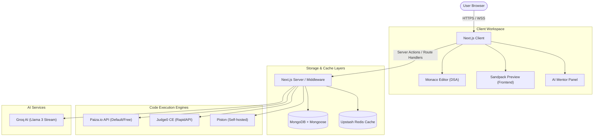

# CodeForge AI ⚒️

[](https://nextjs.org/)
[](https://www.typescriptlang.org/)
[](https://tailwindcss.com/)
[](https://www.mongodb.com/)
[](https://upstash.com/)
[](https://opensource.org/licenses/MIT)

An ultra-modern, production-grade, AI-powered coding interview preparation platform. CodeForge AI bundles LeetCode-style DSA problems, Frontend Mentor-style UI challenges, scheduled contests, personalized learning roadmaps, local mock interviews, and a real-time streaming AI Mentor into a single, cohesive developer workspace.

---

## 🏗️ System Architecture

CodeForge AI uses a decoupled, event-resilient architecture built on top of **Next.js 15 (App Router)**. Below is a high-level representation of how components, caching layers, execution runtimes, and AI models interact:



---

## ✨ Core Features

### 💻 Hybrid Coding Workspaces
* **DSA Code Workspace**: Integrated Monaco Editor featuring customizable themes, font size controls, Vim keybindings, Emmet expansion, fullscreen toggle, and split-pane output layout. Code drafts are auto-saved locally and synced with MongoDB.
* **Frontend UI Sandbox**: In-browser Sandpack playground supporting HTML/CSS, Vanilla JS, React, and Tailwind CSS. Features live hot-reloading previews, a custom console emulator, and automated AI visual reviews.
* **12 Supported DSA Languages**: Run and submit code in JavaScript, TypeScript, Python, Java, C, C++, C#, Go, PHP, Rust, Kotlin, and Swift.

### 🤖 Live AI Mentor (Powered by Groq)
* **Context-Aware Assistance**: The AI mentor understands the exact problem description, code buffer, and runtime output.
* **Progressive Hint System**: Avoids spoiling solutions by dispensing hints step-by-step (e.g., conceptual hints $\rightarrow$ algorithmic logic $\rightarrow$ edge case considerations $\rightarrow$ code optimization).
* **Code Explainer & Visualizer**: Ask "Why is my solution failing?" or request a space/time complexity breakdown. All AI feedback streams in real-time.

### 🎮 Gamification & Streaks
* **GitHub-Style Heatmap**: Visualizes code submission frequency and daily consistency.
* **XP & leveling system**: Earn experience points for correct submissions, fast runs, and completed frontend projects.
* **Unlockable Badges**: Earn milestones based on problem categories, streak lengths, and contest placements.

### 🏆 Live Contests & Leaderboards
* **Time Penalty System**: Built-in score calculation based on completion times and incorrect attempt penalties.
* **Real-time Standings**: Leaderboards computed on-demand using MongoDB aggregate frameworks, cached globally using Upstash Redis.
* **Daily Rotating Challenge**: A community-wide daily question with double XP rewards.

### 🛡️ Mock Interviews
* **Simulated Sessions**: Set up a custom question queue under strict timers.
* **Local Screen Recording**: Record voice, video, and workspace inputs locally in-browser.
* **AI Feedback Performance Report**: Generates a breakdown of code cleanliness, debugging speed, and structural approach.

---

## 🛠️ Technical Stack & Integration Matrix

| Layer | Technology | Primary Purpose | Integration Mechanism |
| :--- | :--- | :--- | :--- |
| **Framework** | **Next.js 15 (App Router)** | Hybrid SSG/SSR rendering, Server Actions, API middleware | Direct routing and action calls |
| **Language** | **TypeScript (Strict)** | Compile-time safety and type enforcement | Monorepo declaration files |
| **Styling** | **Tailwind CSS v4** | Rapid utility styling with zero runtime cost | Configured via Native CSS Modules |
| **Database** | **MongoDB + Mongoose** | Persistent storage of user data, questions, submissions, and metrics | Mongoose ORM models |
| **Caching/Limits** | **Upstash Redis** | Session tokens, request rate-limiting, and leaderboard cache | Upstash REST Client SDK |
| **Auth** | **NextAuth.js v5** | Secure credential & OAuth (Google, GitHub) management | JWT session validation middleware |
| **Sandbox** | **@codesandbox/sandpack** | Client-side frontend compiler and virtual workspace | Embedded React components |
| **Editor** | **@monaco-editor/react** | Rich IDE-like source editing inside the browser | Virtual DOM bindings & State Sync |

---

## 🚦 Getting Started

### Prerequisites

* **Node.js** >= 18.x
* **MongoDB Instance** (Local or MongoDB Atlas cluster)
* **Redis Instance** (Optional; falls back to in-memory store)
* **Groq API Key** (Optional; enables AI mentor functionality)

### Installation

1. **Clone the repository and install dependencies:**
   ```bash
   npm install
   ```

2. **Configure environment variables:**
   Copy the example file to `.env.local` and populate the fields:
   ```bash
   cp .env.example .env.local
   ```

   Configure the mandatory variables in `.env.local`:
   ```env
   # Database connection
   MONGODB_URI="mongodb+srv://..."
   
   # Authentication secret (Generate using `openssl rand -base64 32`)
   AUTH_SECRET="your-generated-auth-secret"
   ```

3. **Launch the development server:**
   ```bash
   npm run dev
   ```
   Open `http://localhost:3000` to preview the application.

---

## ⚙️ Environment Configuration Reference

| Variable | Scope | Status | Purpose / Fallback Behavior |
| :--- | :--- | :--- | :--- |
| `MONGODB_URI` | Core | **Required** | Stores users, questions, contests, submissions, and metadata. |
| `AUTH_SECRET` | Core | **Required** | Used by NextAuth to sign and verify cookies. |
| `GROQ_API_KEY` | AI | *Optional* | Streams hints/explanations. If omitted, AI panels show setup instructions gracefully. |
| `UPSTASH_REDIS_REST_URL` | Cache/Limit | *Optional* | Shared rate limiting & high-performance leaderboards. Falls back to in-memory list. |
| `UPSTASH_REDIS_REST_TOKEN` | Cache/Limit | *Optional* | Authentication token for Upstash Redis. |
| `GOOGLE_CLIENT_ID` / `SECRET` | Auth | *Optional* | Enables one-click sign-in via Google accounts. |
| `GITHUB_CLIENT_ID` / `SECRET` | Auth | *Optional* | Enables one-click sign-in via GitHub accounts. |
| `EXECUTION_PROVIDER` | Execution | *Optional* | Set to `paiza` (default), `judge0`, or `piston` depending on preference. |
| `ADMIN_EMAILS` | Admin | *Optional* | Comma-separated email list promoted automatically to administrators on signup. |

---

## 🏁 Initial Run Checklist

1. **Create an Admin Account**: 
   Add your primary registration email to `ADMIN_EMAILS` in `.env.local`. Register at `/register` to automatically gain administrator access.
2. **Populate Questions**:
   Navigate to the **Admin Dashboard** $\rightarrow$ **Questions**. You can:
   - Click **Generate with AI** and enter a prompt like *"Generate 5 Easy Array Questions"* (requires `GROQ_API_KEY`).
   - Click **Upload JSON** and upload a schema-matching JSON file.
3. **Publish Questions**:
   Flip the **Published** switch on questions you want to make visible to users.
4. **Test Run**:
   Navigate to `/problems`, open a task, select your language of choice, and click **Run Code**.

> [!IMPORTANT]
> **Question Input/Output Contract**
> Code execution evaluates full programs reading from **stdin** and writing to **stdout**. 
> - The test case `input` matches the raw stdin stream.
> - The test case `expected` matches the raw stdout stream.
> 
> Keep this consistent when writing or generating custom questions.

---

## 🔌 Code Execution Engines

CodeForge AI abstractly wraps multiple code execution providers under a single `ExecutionProvider` interface. Switch runtime backends instantly by updating the `EXECUTION_PROVIDER` env variable:

* **Paiza (Default)**: Out-of-the-box support without API keys. Ideal for local dev environments and zero-config deployment.
* **Judge0 CE**: High-concurrency sandbox using RapidAPI. Excellent for high-performance setups. Requires `EXECUTION_PROVIDER=judge0` and `JUDGE0_API_KEY`.
* **Self-hosted Piston**: Access an isolated, self-hosted Dockerized execution cluster. Set `EXECUTION_PROVIDER=piston` and `PISTON_URL`.

---

## 📉 Graceful Degradation & Resilience

CodeForge AI is designed to operate even with minimal external API integrations:

* **No Groq Configured**: All AI Mentor panels dynamically render an inline setup alert instructing admins how to provide keys. Standard editor compiles, test run features, and user metrics function fully.
* **No Redis Configuration**: The platform falls back to an in-process memory cache for rate-limiting calculations, and calculates contest rankings directly from MongoDB collections on-demand.
* **Omitted OAuth (Google/GitHub)**: The Auth logic automatically hides provider login buttons if credentials are not configured, defaulting seamlessly to traditional email/password credentials.

---

## 🧪 Testing and Tooling

Use the following commands to check codebase integrity:

```bash
# Run unit & component tests using Jest
npm test

# Run end-to-end integration tests using Playwright
npm run test:e2e

# Perform code static analysis via ESLint
npm run lint

# Compile and typecheck without emitting output files
npm run typecheck
```

---

## 🚀 Deployment

CodeForge AI is fully optimized for Vercel out of the box:

1. Import your GitHub repository to Vercel.
2. Ensure you add all required environment variables.
3. Deploy. The repository contains a pre-configured `vercel.json` structure that handles standard Serverless Function timeouts for execution and streaming AI routes.

